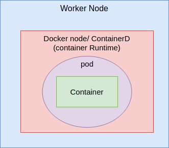
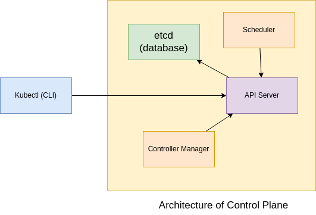
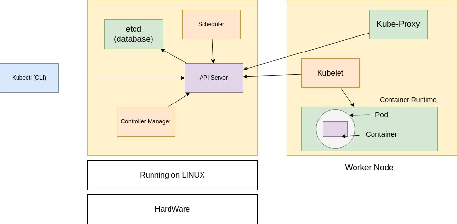

# 🚀 Kubernetes: From Zero to Hero

## 📖 Table of Contents
- [What is Kubernetes?](#what-is-kubernetes)
- [Why Kubernetes?](#why-kubernetes)
- [Core Concepts](#core-concepts)
- [Kubernetes Architecture](#kubernetes-architecture)
- [Installation](#installation)
- [Basic kubectl Commands](#basic-kubectl-commands)
- [Deploying Applications](#deploying-applications)
- [Advanced Concepts](#advanced-concepts)

---

## What is Kubernetes?

**Kubernetes** (also known as **K8s**) is an open-source container orchestration platform designed to automate the deployment, scaling, and management of containerized applications. It's much more than just an orchestrator—it's a complete platform for managing containerized workloads.

---

## Why Kubernetes?

- **🎯 Orchestration**: Automatically manage and schedule containers across clusters
- **📈 Scalability**: Easily scale applications up or down based on demand
- **🔄 Self-healing**: Automatically replaces failed containers and reschedules them
- **⚖️ Load Balancing**: Distributes network traffic effectively across pods
- **🔄 Rolling Updates & Rollbacks**: Update applications with zero downtime
- **🌐 Service Discovery**: Automatic DNS-based service discovery
- **💾 Storage Management**: Automatic mounting of storage systems

---

## Core Concepts



### 🏗️ Kubernetes Cluster
A collection of **worker nodes** (servers) and a **control plane** (previously known as master node) that work together to run containerized applications.

### 🖥️ Node
A worker machine (virtual or physical) where containers are deployed and managed.

### 📦 Pod
The **smallest deployable unit** in Kubernetes. A Pod can contain one or more tightly coupled containers that share storage and network.

### 🌐 Service
An abstraction that defines a logical set of Pods and provides a stable endpoint to access them.

### 🚀 Deployment
A controller that manages the deployment and scaling of a set of Pods, ensuring the desired number of replicas are running.

---

## Kubernetes Architecture

### Application Deployment Flow

1. **Create Microservices** → Write your application code
2. **Containerize Services** → Package each service into containers
3. **Create Pods** → Deploy containers inside Pods
4. **Use Controllers** → Deploy Pods using Deployments for management

> **Controllers** in Kubernetes are control loops that watch the cluster state and make changes to move the current state closer to the desired state.

---

## 🎛️ Control Plane Components



The control plane manages the overall health and state of the cluster:

| Component | Function | Port |
|-----------|----------|------|
| **API Server** | Central communication hub for all cluster operations | HTTPS/443 |
| **etcd** | Distributed key-value store that holds cluster state and configuration | 2379-2380 |
| **Controller Manager** | Manages various controllers that regulate cluster state | 10257 |
| **Scheduler** | Assigns Pods to worker nodes based on resource requirements | 10259 |

### Controller Manager Functions:
1. **Desired State Management** - Maintains desired configuration
2. **Current State Monitoring** - Tracks actual cluster state  
3. **Difference Detection** - Identifies discrepancies
4. **Reconciliation** - Makes necessary changes to achieve desired state

---

## 👷 Worker Node Components



Each worker node runs the following components:

- **🤖 Kubelet**: Primary node agent that communicates with the API server and manages containers
- **🌐 Kube-Proxy**: Network proxy that maintains network rules and enables service communication
- **🗂️ Container Runtime**: Software responsible for running containers (Docker, containerd, etc.)
- **📡 DNS**: Provides service discovery within the cluster

---

## 🛠️ Installation

### Minikube (Local Development)

Minikube runs a single-node Kubernetes cluster locally for development and testing.

#### Prerequisites:
- Docker or VirtualBox
- kubectl CLI tool

#### Install Minikube:

```bash
# Download and install Minikube
curl -LO https://storage.googleapis.com/minikube/releases/latest/minikube-linux-amd64
sudo install minikube-linux-amd64 /usr/local/bin/minikube

# Start Minikube cluster
minikube start

# Verify installation
minikube status
```

#### Install kubectl:

```bash
# Update package list
sudo apt-get update
sudo apt-get install -y apt-transport-https ca-certificates curl

# Add Kubernetes signing key
sudo curl -fsSLo /usr/share/keyrings/kubernetes-archive-keyring.gpg https://packages.cloud.google.com/apt/doc/apt-key.gpg

# Add Kubernetes repository
echo "deb [signed-by=/usr/share/keyrings/kubernetes-archive-keyring.gpg] https://apt.kubernetes.io/ kubernetes-xenial main" | sudo tee /etc/apt/sources.list.d/kubernetes.list

# Install kubectl
sudo apt-get update
sudo apt-get install -y kubectl

# Verify installation
kubectl version --client
```

---

## 🎮 Basic kubectl Commands

### Cluster Information
```bash
kubectl version                       
kubectl cluster-info                
kubectl get nodes                    
```

### Pod Management
```bash
kubectl get pods                      # List all pods in default namespace
kubectl get pods -A                   # List pods in all namespaces
kubectl describe pod <pod-name>       # Get detailed pod information
kubectl logs <pod-name>               # View pod logs
kubectl delete pod <pod-name>         # Delete a specific pod
```

### Deployment Management
```bash
kubectl get deployments              # List all deployments
kubectl create deployment <name> --image=<image>  # Create deployment
kubectl scale deployment <name> --replicas=3      # Scale deployment
kubectl rollout status deployment/<name>         
```

---

## 🚀 Deploying Applications

### Sample Deployment

Create a `deployment.yaml` file:

```yaml
apiVersion: apps/v1
kind: Deployment
metadata:
  name: hello-deployment
  labels:
    app: hello
spec:
  replicas: 3
  selector:
    matchLabels:
      app: hello
  template:
    metadata:
      labels:
        app: hello
    spec:
      containers:
      - name: hello-container
        image: nginx:latest
        ports:
        - containerPort: 80
        resources:
          requests:
            memory: "64Mi"
            cpu: "250m"
          limits:
            memory: "128Mi"
            cpu: "500m"
```

Apply the deployment:
```bash
kubectl apply -f deployment.yaml
```

### Expose with Service

Create a `service.yaml` file:

```yaml
apiVersion: v1
kind: Service
metadata:
  name: hello-service
spec:
  type: NodePort
  selector:
    app: hello
  ports:
  - protocol: TCP
    port: 80
    targetPort: 80
    nodePort: 30001
```

Apply the service:
```bash
kubectl apply -f service.yaml
```

### Access Your Application

```bash
# Get Minikube IP
minikube ip

# Access in browser
http://<minikube-ip>:30001
```

---

## 🔧 Advanced Concepts

### Namespaces

Namespaces provide resource isolation within a cluster:

```bash
# Create namespace
kubectl create namespace development
kubectl create namespace production

# List namespaces
kubectl get namespaces

# Deploy to specific namespace
kubectl apply -f app.yaml --namespace=development

# Set default namespace
kubectl config set-context --current --namespace=development
```

### ConfigMaps

Store non-confidential configuration data:

```bash
# Create ConfigMap from literals
kubectl create configmap app-config \
  --from-literal=APP_ENV=production \
  --from-literal=LOG_LEVEL=info

# Create from file
kubectl create configmap app-config --from-file=config.properties

# View ConfigMaps
kubectl get configmaps
kubectl describe configmap app-config
```

### Secrets

Store sensitive information securely:

```bash
# Create secret from literals
kubectl create secret generic app-secret \
  --from-literal=DB_PASSWORD=supersecret \
  --from-literal=API_KEY=abc123

# Create from file
kubectl create secret generic app-secret --from-file=credentials.txt

# View secrets (values are base64 encoded)
kubectl get secrets
kubectl describe secret app-secret
```

### Persistent Volumes

Manage storage that persists beyond pod lifecycle:

```yaml
apiVersion: v1
kind: PersistentVolume
metadata:
  name: my-pv
spec:
  capacity:
    storage: 1Gi
  accessModes:
    - ReadWriteOnce
  persistentVolumeReclaimPolicy: Retain
  hostPath:
    path: /data
    type: Directory
---
apiVersion: v1
kind: PersistentVolumeClaim
metadata:
  name: my-pvc
spec:
  accessModes:
    - ReadWriteOnce
  resources:
    requests:
      storage: 1Gi
```

### Pod with Volume Mount

```yaml
apiVersion: v1
kind: Pod
metadata:
  name: volume-demo
spec:
  containers:
  - name: app
    image: nginx
    volumeMounts:
    - name: storage
      mountPath: /usr/share/nginx/html
  volumes:
  - name: storage
    persistentVolumeClaim:
      claimName: my-pvc
```

---

## 🎯 Best Practices

- **🏷️ Use Labels**: Organize resources with meaningful labels
- **📊 Resource Limits**: Always set CPU and memory limits
- **🔍 Health Checks**: Implement liveness and readiness probes
- **🔒 Security**: Use RBAC and network policies
- **📦 Namespaces**: Separate environments and teams
- **📈 Monitoring**: Implement logging and monitoring solutions

---

## 📚 Next Steps

- Learn about **Helm** for package management
- Explore **Ingress Controllers** for advanced routing
- Study **Custom Resource Definitions (CRDs)**
- Implement **CI/CD pipelines** with Kubernetes
- Explore **service mesh** technologies like Istio

For more information, visit the [official Kubernetes documentation](https://kubernetes.io/docs/).